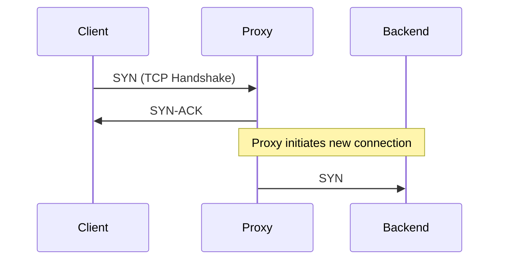

# AGENTS.md: Architecture & Style Guide

This file provides the technical standards and architectural guidance for Codex when working in this repository. It defines the "Harshit Writing Style Guide" modeled after Hussein Nasser's pragmatic, "no-nonsense" system design explainer style.

## About the Blog

This is Harshit Yadav's personal technical blog, hosted at https://harshityadav.in. It uses Jekyll with the Chirpy theme for static site generation on GitHub Pages. 
Git repository: https://github.com/harshityadav95/harshityadav95.github.io

## Commands

```bash
# Install dependencies
bundle install
pnpm install

# Run local development server (preferred)
./tools/run.sh

# Build the site
bundle exec jekyll build

# Run Playwright smoke tests
pnpm test
```

## Project Structure

- `_posts/` - Blog posts in Markdown (`YYYY-MM-DD-post-slug.md`)
- `_data/authors.yml` - Author definitions (harshityadav95 = Harshit Yadav)
- `_tabs/` - Navigation pages (about, archives, categories, tags)
- `_config.yml` - Site configuration (theme, SEO, analytics, comments)
- `assets/img/posts/` - Static files and images for posts

## Blog Post Review

Reviews prioritize: (1) architectural clarity and "the why", (2) technical accuracy at the network/OS layer, (3) reader experience and pragmatic tone, (4) front matter, (5) scope. No percentage scoring — output is a ranked list of issues with quoted text and suggested fixes.

---

# Harshit Writing Style Guide (The "Hussein Nasser" Method)

This section captures the strict engineering communication style for Harshit's blog. The goal is to explain the "why" and "how" of systems, unpacking abstractions, and discussing raw technical trade-offs.

> **Post-writing step:** After completing each post, update this style guide with any corrections, terminology changes, or stylistic feedback provided during the writing session.
{: .prompt-info}

### Voice & Tone: Pragmatic & Deeply Technical

**Personality:**
- Conversational but highly authoritative on technical details.
- Pragmatic and "no-nonsense" (no fluff, no marketing speak, no magic).
- Direct address to the reader ("Let's think about this", "What happens if we drop the connection?", "Right?").
- Enthusiastic about raw engineering ("Beautiful, right?", "This is fascinating").

**Explanatory Style:**
- **Unpack the Abstraction:** Never just say "we use a reverse proxy." Explain *what* the reverse proxy is doing at Layer 4 or Layer 7.
- **Protocol-Level Focus:** Reference TCP handshakes, TLS termination, HTTP headers, WebSockets, or packet flow when relevant.
- **Emphasize Trade-offs:** Every architectural choice has pros and cons. Discuss latency, throughput, memory, stateful vs. stateless, and connection pooling.
- **Progressive Disclosure:** Start with the bare-bones foundation (e.g., a simple client-server), introduce a failure mode (e.g., server dies under load), and then introduce the architectural solution (e.g., load balancer).

### Quick Reference Checklist

- [ ] Opens with the fundamental problem (The "Why").
- [ ] Breaks down the architecture visually (Mermaid diagram mandatory for systems).
- [ ] Explains the flow of a request/packet step-by-step.
- [ ] Avoids "magic" — shows raw configs, headers, CLI commands, or OS-level behavior.
- [ ] Explicitly discusses trade-offs (Pros/Cons, latency, memory implications).
- [ ] Conversational interjections: "Right?", "At the end of the day", "Let's see how this works."
- [ ] Complete working code examples/configs (not snippets).
- [ ] 5-8 specific tags in front matter.
- [ ] Minimum 2-3 internal links to related posts for SEO.

### Post Structure

Standard flow for system design and technical posts:

```text
1. THE PROBLEM (The "Why")
   - What are we trying to solve? 
   - Why did the previous or naive architecture fail?
   - "Let's think about this..."

2. THE ARCHITECTURE (The "How")
   - High-level overview.
   - Mermaid diagram showing the components and request flow.
   
3. THE DEEP DIVE (Unpacking the Abstraction)
   - Step-by-step technical implementation.
   - CLI commands, NGINX configs, Docker compose files.
   - What happens at the network/protocol layer?

4. TRADE-OFFS & LIMITATIONS
   - "Nothing is free in software engineering."
   - Pros and Cons. What are the latency and state implications?

5. CONCLUSION & CALL TO ACTION
   - Summary and final thoughts.
   - Engagement question: "How do you handle X in your architecture?"
```

### Technical Content Formatting

**Code & Config Blocks:**
- Always use complete, reproducible configurations or code.
- Specify language: ```yaml, ```bash, ```nginx, ```json
- Precede with context: "Here's what the raw NGINX configuration looks like..."
- Explain the "why" before the "what".

**Mermaid Diagrams:**
Crucial for visualizing system design. Add `mermaid: true` to front matter.
```markdown

```

### Front Matter Template

```yaml
---
layout: post
title: "Clear, Specific Title: A Deep Dive into X"
date: YYYY-MM-DD
categories: [System Design, Networking]
tags: [nginx, reverse-proxy, layer-7, tcp, architecture]
description: "A pragmatic breakdown of how X works under the hood and the architectural trade-offs."
author: harshityadav95
image:
  path: /assets/img/posts/post-slug/header-image.png
  alt: Architecture diagram of X
published: true
mermaid: true
---
```

**Common Categories:** `System Design`, `Networking`, `Backend`, `DevOps`, `Security`, `Databases`

### Examples of Tone

**Good Opening:**
> Let's think about this. You have a backend service, and suddenly you're getting hit with thousands of concurrent connections. Your server starts dropping TCP connections. Why? Today, we're going to unpack exactly what happens at the OS level and how to fix it.

**Bad Opening:**
> In this tutorial, I will show you how to configure a load balancer to handle traffic.

**Good Trade-off Explanation:**
> Beautiful, right? But what's the catch? By adding this proxy, we've introduced an extra network hop. That's a minimum of a few milliseconds of latency, plus the proxy has to maintain state for both the client and the backend connections. At the end of the day, you're trading memory and latency for high availability.

**Bad (hiding limitations):**
> This is the best and most scalable way to deploy a backend.

**Good Config Introduction:**
> Let's look at the NGINX configuration. Pay attention to the `proxy_pass` directive—that's where the Layer 7 routing magic happens:

### Jekyll Formatting & Linking

**Prompt Boxes** (Chirpy theme):
```markdown
> Remember, DNS caching can completely bypass your load balancing if not configured correctly.
{: .prompt-warning }

> This is a helpful tip about connection pooling.
{: .prompt-tip }
```

**Images:**
```markdown
{: .shadow w="700" h="400" }
```

**Internal Links (SEO):**
Every post should include minimum 2-3 contextual links using Jekyll's `post_url` tag:
```markdown
If you missed it, check out my deep dive on [Cloudflare Tunnels]() for the networking context.
```
*Do NOT add a manual "Further Reading" section. Chirpy auto-generates one based on shared tags.*

### Post Length Guidelines

| Type | Word Count | Use Case |
|------|------------|----------|
| Explainer | 1,500-2,500 | Explaining a specific protocol or tool |
| Deep dive | 3,000-6,000+ | Complete architecture breakdown and implementation |

Most posts should aim for the "Deep dive" category, ensuring we never hand-wave over the technical details.
