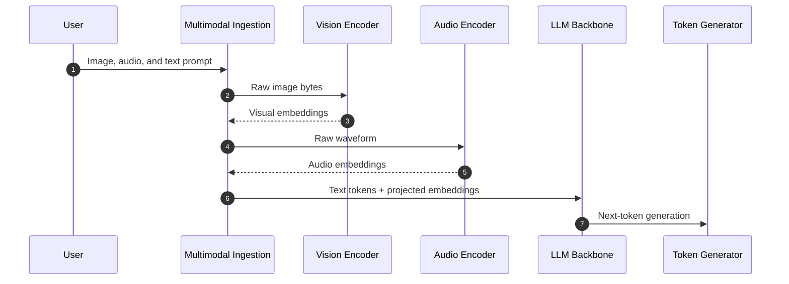
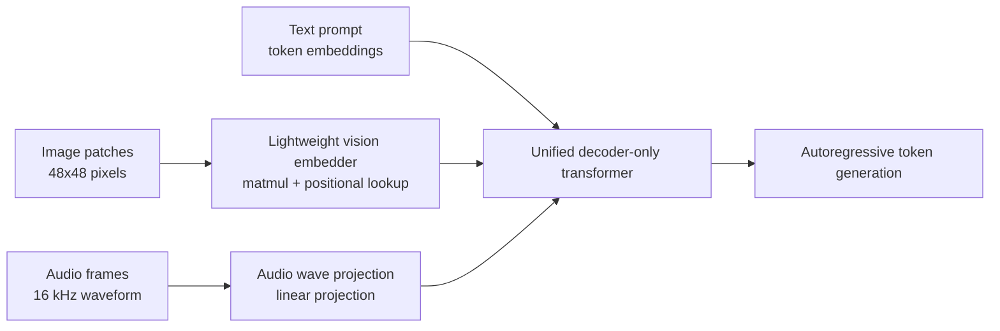
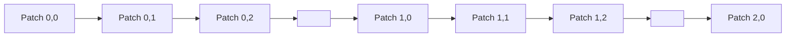

Google just dropped Gemma 4 12B, and they are heavily promoting its "unified, encoder-free" architecture. But what does that actually mean under the hood?

Why should we, as software engineers and systems architects, care?

Because this is not just another model announcement. This is an architectural shift in how multimodal inputs move through a model. Images, audio, and text are no longer treated like separate systems glued together with adapters. They are pushed into a single decoder-only transformer pipeline.

Let's think about this from first principles.

If you want a model to reason over an image, the naive question is: "Can the LLM see?"

The real engineering question is different: "How do raw pixels become vectors that the transformer can attend to?"

That one question decides latency, memory footprint, fine-tuning complexity, and whether this thing can realistically run on a laptop instead of a dedicated inference box.

If you have read my deep dive on [Google TurboQuant](), the theme is familiar: AI inference is not only about math. It is about memory movement, data layout, and the cost of abstractions.

## The Old Way: Multimodal as a Proxy Chain

Traditionally, if you wanted a Large Language Model (LLM) to understand an image or an audio file, you could not just throw raw bytes at the text model. The LLM core understood text tokens and their embeddings. Pixels and waveforms lived in a completely different world.

So what did the industry do?

We did what engineers always do when two systems do not speak the same language: we inserted a translation layer.

For images, that translation layer was usually a vision encoder. Think Vision Transformer (ViT), CLIP-like encoders, or another heavy vision stack trained to turn pixels into semantic feature vectors. For audio, the story was similar: a separate audio encoder processed waveform chunks and emitted representations the LLM could consume.

Architecturally, the request looked like this:



This works. But from a systems perspective, it is expensive.

You are holding multiple model components in memory at the same time. The vision encoder has its own layers, weights, activation flow, and memory pressure. The audio encoder has its own stack. The language model then has its own KV cache and decode loop.

Right away, you get three problems:

1. **Fragmented memory:** VRAM or unified memory is split across separate model subsystems.
2. **Pipeline latency:** the LLM waits while the encoders finish translating the input.
3. **Training complexity:** fine-tuning becomes a multi-component problem, especially if some encoders are frozen and others are trainable.

This is like building a distributed system where every request must pass through multiple synchronous services before the core service even starts doing useful work. It is manageable at scale, but it is not free. Nothing is free in software engineering.

## The Encoder-Free Way: Direct Routing

Gemma 4 12B changes the shape of that pipeline.

Instead of routing image and audio through heavy dedicated encoders, Google moved toward a unified decoder-only transformer. The model still needs to convert pixels and waveform samples into vectors, obviously. A transformer cannot attend to PNG bytes directly. But the translation step is made much thinner.

For vision, the developer guide describes a lightweight **35M parameter vision embedder**. Raw image patches are projected into the LLM hidden dimension using a single matrix multiplication, with positional information attached through coordinate lookup.

For audio, the separate audio encoder is removed. Raw 16 kHz audio is sliced into frames and linearly projected into the same input space.

So the architecture becomes this:




The model is not "seeing" in the human sense. It is normalizing different input types into one token-like stream. Once that stream reaches the transformer, self-attention does what self-attention always does: it builds relationships between positions in a sequence.

{: .shadow w="700" h="400" }

## What Actually Happens to an Image?

The interesting part is the image path.

In the older architecture, the vision encoder did a lot of semantic preprocessing before the LLM saw anything. It extracted visual features, compressed the image into a representation, and handed that representation to the language model.

In Gemma 4 12B, the image path is much closer to the raw input.

The system slices the image into **48x48 pixel patches**. Each patch is then projected into the LLM's hidden dimension through a lightweight embedding module. After that, positional information is attached so the model can reason about where each patch lives in the image.

That last part is critical.

If you flatten an image into patches, you risk destroying the spatial structure. The model needs to know that patch 1 is next to patch 2, that another patch is one row below, and that objects are spread across multiple neighboring patches.

Without spatial information, an image becomes a bag of patch vectors. That is not vision. That is chaos.

## Raster Scan: Turning Images into Sequences

The trick is to treat the image like a sequence.

Imagine cutting an image into a grid. You start from the top-left patch, move left to right across the first row, then drop to the next row. Exactly like reading text.

This is raster-scan ordering.



Now the image is a token stream. The transformer can attend across the sequence. It can learn that two adjacent patches in the sequence are horizontally related, and that patches separated by a row width are vertically related.

{: .shadow w="700" h="400" }

## Positional Embeddings: Baking Space into Tokens

If the image is flattened, where does the 2D structure go?

It goes into positional embeddings.

Text transformers already need positional information. The token "server" at position 3 and the token "server" at position 300 are not the same event in the sequence. Position changes meaning.

The same idea applies to image patches. Each patch gets information about where it sits in the grid. Gemma's vision embedder uses factorized coordinate lookup, with X and Y matrices, to attach spatial location information directly to the patch projection.

So the model receives something like:

```text
patch_vector + x_position + y_position
```

That is the whole game.

We are not building a separate visual reasoning system and then asking the LLM to understand its output. We are feeding image-derived tokens into the same transformer loop and letting attention build the relationships.

Right?

This is why the "encoder-free" term matters. It does not mean there is zero input processing. It means there is no heavy multimodal encoder stack sitting in front of the LLM as a separate semantic translation service.

## The Image Newline Token

There is one more neat detail: the **image newline token**.

If image patches are arranged like text, then rows need boundaries. Otherwise, the model has to infer where one row ends and the next begins only from positional math.

The image newline token acts like `\n` in text. It tells the model: this row is done, move to the next row.

That matters for arbitrary aspect ratios. A square image, a tall screenshot, and a wide diagram do not have the same number of patches per row. If you force everything into one fixed resolution, you distort information. If you preserve patch rows with newline boundaries, you keep the layout closer to the original input.

{: .shadow w="700" h="400" }

This is the same principle we care about in backend systems: preserve structure as long as possible. Do not destroy useful information early in the pipeline and then ask a later stage to magically recover it.

## Why This Matters for Local AI

The obvious headline is that Gemma 4 12B targets local execution on machines with around 16GB of VRAM or unified memory.

But the deeper story is architectural efficiency.

When the model avoids large separate encoders, it reduces duplicated memory pressure. Instead of keeping a medium-sized language model plus a large vision model plus an audio model hot in memory, the system routes everything into one backbone.

That has practical consequences:

1. **Lower time-to-first-token:** the model skips heavy pre-encoding stages before generation begins.
2. **Cleaner memory profile:** fewer separately loaded model blocks compete for VRAM.
3. **Simpler fine-tuning path:** adapters or full tuning can update the shared multimodal flow instead of coordinating frozen encoders with a separate LLM.
4. **Better fit for laptops:** unified memory machines, especially Apple Silicon systems, benefit when the pipeline avoids unnecessary model fragmentation.

This is also why local AI is becoming more interesting in 2026. The shift I wrote about in [The Future of Blogging in the AI Era]() is not only about how people consume information. It is also about where inference runs. If a capable multimodal model runs locally, the user experience changes completely: lower network dependency, better privacy posture, and faster interactive loops.

## What About Audio?

Audio follows the same philosophy.

In older multimodal architectures, audio normally went through a dedicated audio encoder. That encoder transformed waveform data into a representation the LLM could consume.

Gemma 4 12B removes that separate encoder path. The developer guide describes raw 16 kHz audio being sliced into 40 ms frames and projected linearly into the LLM input space.

This is fascinating because audio is temporal by nature. A waveform is already a sequence. The architecture does not need to invent sequence structure; it needs to normalize audio frames into the transformer's embedding space.

At the end of the day, image patches, audio frames, and text tokens become different kinds of entries in the same stream.

That is the architectural simplification.

## The Trade-Offs

Now, let us be honest. Encoder-free does not mean automatically better in every dimension.

The old encoder-based approach exists for a reason. A dedicated vision encoder can be extremely good at extracting visual features. It has layers specialized for visual structure before the language model ever gets involved. If you remove that heavy encoder, the LLM backbone has to absorb more of the visual reasoning burden.

So what are we trading?

### Pros

- **Lower latency:** fewer synchronous preprocessing stages before decoding.
- **Lower memory fragmentation:** fewer separate model subsystems loaded at once.
- **Unified training:** multimodal behavior can be tuned through one shared backbone.
- **Flexible input routing:** image, audio, and text become token-like streams.
- **Better local deployment fit:** the architecture aligns with consumer hardware constraints.

### Cons

- **More burden on the transformer backbone:** visual and audio reasoning move deeper into the LLM.
- **Training complexity shifts earlier:** the model must learn multimodal grounding directly, not rely on a mature separate encoder.
- **Potential quality trade-offs:** specialized encoders may still win on narrow perception tasks.
- **Sequence length pressure:** high-resolution images become many patches, which means more tokens and more attention work.

That last point is important.

Encoder-free vision does not delete the cost of pixels. It changes where the cost lands. A bigger image still produces more patch tokens. More patch tokens still increase context pressure. The transformer still has to attend over a larger sequence.

So yes, we removed the heavy proxy. But we did not remove physics.

## Why This Is a Big Architectural Move

The reason this matters is not that Gemma 4 12B has a nice model card. The reason this matters is that it moves multimodal AI closer to a single systems pipeline.

The old architecture was:

```text
image -> vision model -> adapter -> LLM
audio -> audio model -> adapter -> LLM
text  -> tokenizer -> LLM
```

The new architecture is closer to:

```text
image patches -> lightweight projection -> unified transformer
audio frames  -> lightweight projection -> unified transformer
text tokens   -> embedding lookup      -> unified transformer
```

This is a cleaner abstraction.

Not a magical abstraction. A cleaner one.

If you have built backend systems, you know the difference. A bad abstraction hides cost. A good abstraction exposes the right boundary and removes unnecessary moving parts.

Gemma 4 12B is interesting because it removes a major boundary: the external multimodal encoder. That reduces the number of components, lowers memory pressure, and makes local inference more realistic.

 ear in front of the model, and started teaching the transformer to consume the world as one sequence.

## References

- [Introducing Gemma 4 12B: a unified, encoder-free multimodal model](https://blog.google/innovation-and-ai/technology/developers-tools/introducing-gemma-4-12b/)
- [Gemma 4 12B: The Developer Guide](https://developers.googleblog.com/gemma-4-12b-the-developer-guide/)
- [Hello World in TensorFlow]()
