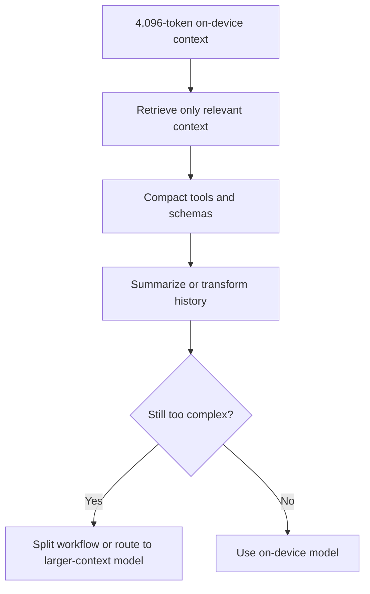
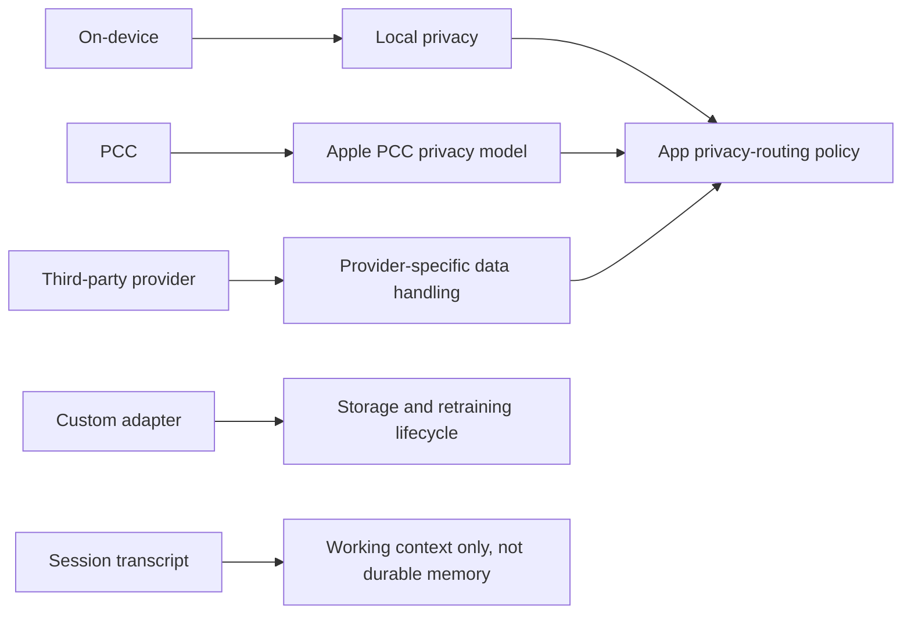
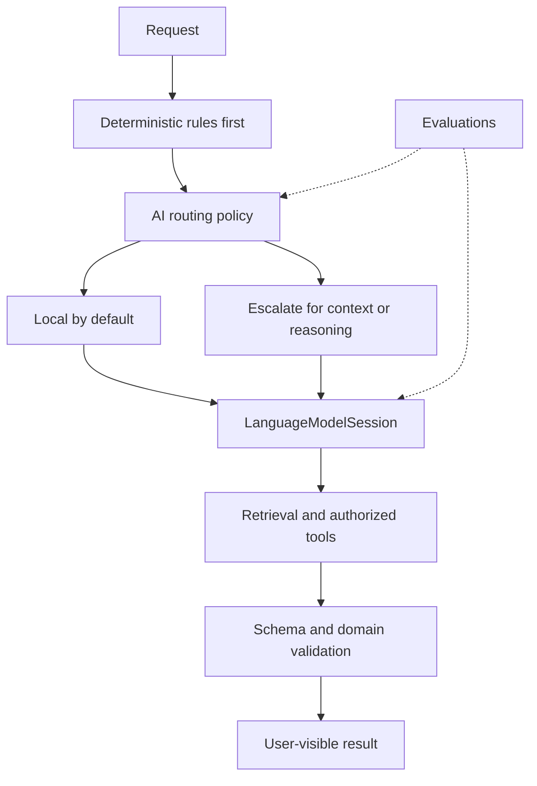

## TLDR

Today, most apps integrate AI separately—each app calls its own model API, manages prompts, tools, safety, context, and cloud logic.

Apple and Android are moving toward a **unified AI architecture**:

**App → OS AI Framework → Best Available Model → Device or Cloud**

Instead of every app reinventing the AI stack, the operating system provides a common layer for model access, privacy, tools, multimodal input, and execution.

The important shift is simple:

**AI is moving from app-level integration to platform-level infrastructure.**

# Android ( inshort)

# Apple

Apple’s Foundation Models framework is rapidly changing from a convenient Swift API for one Apple on-device model into a **model-neutral orchestration layer for generative AI on Apple platforms**.

The important architectural shift in OS 27 is that `LanguageModelSession` becomes the stable application-facing interface while the actual model can change underneath it. The model may be Apple’s `SystemLanguageModel`, Apple’s `PrivateCloudComputeLanguageModel`, a local model through Core AI or MLX, or a third-party/server model that conforms to the public `LanguageModel` protocol.[[1]](https://developer.apple.com/videos/play/wwdc2026/339/)

For developers, the framework now combines five major ideas:

1. **A common session and transcript abstraction** for multiple models.
2. **Structured generation and tool calling** so model output can drive real application logic.
3. **Dynamic Profiles** for changing the model, tools, instructions, and context policy inside a continuous session.
4. **Multimodal input and system tools**, including image understanding, OCR, barcode reading, and Spotlight-backed retrieval.
5. **Evaluation and observability**, because models and guardrails can change with OS updates and cannot be tested like deterministic functions.

The next year is therefore less about “Apple adding a chatbot API” and more about Foundation Models becoming the **AI middleware layer of the Apple developer stack**.

---

# 1. What the Foundation Models framework is — and what it is not

The Foundation Models framework is the application-facing API for running generative-model tasks such as summarization, extraction, classification, refinement, structured generation, tool use, and increasingly multimodal reasoning.[[2]](https://developer.apple.com/documentation/foundationmodels/)

It is **not**:

- the whole Apple Intelligence product;
- a public API for replacing Siri;
- a durable memory or database layer;
- an authorization system for model-triggered actions;
- a guarantee that every model has identical capabilities;
- a generic API for every Apple Intelligence feature such as Image Playground;
- a promise that an API or model response will remain behaviorally identical after an OS update.

App Intents remains the main framework for exposing app actions and entities to Siri and other system experiences. Foundation Models is for intelligence **inside your application or service boundary**.[[3]](https://developer.apple.com/wwdc26/guides/apple-intelligence/)

---

# 2. Architecture

The cleanest mental model is to divide the framework into a **control plane** and an **execution plane**.

---

# 3. Current and announced model options

| Model path | Execution | Best fit | Important constraints |
| --- | --- | --- | --- |
| **SystemLanguageModel** | On device | Summarization, extraction, classification, rewriting, short dialog, tool selection, private/offline tasks | 4,096-token context; smaller than frontier models; availability depends on Apple Intelligence support/settings |
| **PrivateCloudComputeLanguageModel** | Apple Private Cloud Compute | Harder reasoning, larger documents, agentic tasks, model-as-judge | 32K context announced at WWDC26; network/server dependency; developer eligibility rules apply |
| **CoreAILanguageModel** | Local model through Core AI | Shipping a custom model locally with control over weights and runtime | App/device storage, memory, thermal and hardware constraints become your responsibility |
| **MLXLanguageModel** | Local MLX model | Open models, experimentation, especially on Mac | Capabilities, context and performance depend on the selected model |
| **Third-party LanguageModel** | Provider-defined local or server runtime | Claude, Gemini, internal models, specialized providers | Privacy, pricing, authentication, latency and feature support are provider-specific |

Apple says the rebuilt OS 27 on-device model is better at instruction following and accepts images directly in prompts. PCC adds stronger reasoning and a **32K context window**.[[1]](https://developer.apple.com/videos/play/wwdc2026/339/)

---

# 4. Framework capabilities developers should design for

---

## Announced or already in beta

#### 1. OS 27 APIs move from beta toward production use

#### 2. Claude and Gemini integrations through native Swift packages

#### 3. More model-provider packages

#### 4. Agent composition becomes a first-class application pattern

#### 5. More multimodal and model-specific capability negotiation

#### 6. Local-model integration becomes more important

#### 7. Evaluation-driven development becomes necessary

## Not announced — do not design as assumptions

Apple has **not** publicly committed to the following for the next 12 months:

- a specific OS 28 Foundation Models feature set;
- a larger on-device context window than the currently documented 4,096 tokens;
- unrestricted PCC access for every developer;
- built-in long-term user memory;
- fully autonomous background agents with unrestricted system access;
- a Foundation Models API that replaces App Intents or Siri;
- universal capability parity among Apple, Claude, Gemini, MLX, Core AI and other providers;
- a general-purpose Apple image-generation model exposed through the same `LanguageModelSession` API.

Designing around any of these as guaranteed roadmap items would be premature.

---

# The most important limitations

## On-device context is small

Apple documents a **4,096-token context window per on-device session**. The budget includes instructions, prompts, tool definitions, tool input/output, generated responses and guided-generation schemas.[[15]](https://developer.apple.com/documentation/foundationmodels/managing-the-context-window)

That has architectural consequences:

- do not stuff entire databases or long mailboxes into a prompt;
- retrieve only relevant content;
- keep tool schemas compact;
- summarize or transform history;
- split complex workflows into stages;
- escalate long-context work to PCC or another server model.

PCC’s announced 32K context is significantly larger, but it is still finite.[[1]](https://developer.apple.com/videos/play/wwdc2026/339/)

## The on-device model is not a frontier reasoning model

Apple’s own prompting guidance says techniques built for larger frontier models do not transfer directly because the on-device model is smaller. Apple recommends concise prompts, reducing required reasoning, and decomposing complex prompts into simpler requests.[[16]](https://developer.apple.com/documentation/foundationmodels/prompting-an-on-device-foundation-model)

Use the on-device model for narrow, frequent, private tasks. Route tasks requiring deep reasoning or large context elsewhere.

## Model behavior can change after an OS update

Apple explicitly tells developers to retest prompts when the system model changes. The model was updated in iOS 26.4 and rebuilt again for OS 27.[[9]](https://developer.apple.com/documentation/updates/foundationmodels)

Therefore, prompts should be versioned artifacts with evaluation datasets—not strings hidden throughout UI code.

## Guardrails can change independently

Apple’s built-in guardrails can block sensitive input or output, and Apple may update those guardrails outside the normal OS release cycle. A previously working prompt can therefore begin returning a guardrail error.[[14]](https://developer.apple.com/documentation/FoundationModels/improving-the-safety-of-generative-model-output)

Your product needs explicit handling for refusals, guardrail violations and safe fallbacks.

## Prompt injection remains an application problem

Apple warns against placing untrusted user or external content inside session instructions because instructions have higher priority than prompts. Webpages, email text, documents and tool output should remain untrusted data.[[14]](https://developer.apple.com/documentation/FoundationModels/improving-the-safety-of-generative-model-output)

The framework does not remove the need for trust boundaries.

## Runtime availability is not guaranteed

`SystemLanguageModel` availability must be checked at runtime. Availability can depend on whether the device supports Apple Intelligence and whether Apple Intelligence is enabled. PCC also depends on device/region support.[[17]](https://developer.apple.com/documentation/foundationmodels/systemlanguagemodel/availability-swift.enum)[[18]](https://developer.apple.com/documentation/foundationmodels/privatecloudcomputelanguagemodel)

Every feature needs an unavailable state or non-AI fallback.

## Provider-neutral does not mean provider-identical

A custom executor translates Foundation Models options into whatever the provider supports. Apple’s documentation explicitly notes that providers may need to approximate an unsupported option.[[5]](https://developer.apple.com/documentation/foundationmodels/languagemodelexecutor)

Capabilities, sampling, reasoning controls, token limits, tool semantics, metadata, multimodality and error behavior can vary. Your app should query capabilities and test each provider instead of assuming perfect portability.

## Private Cloud Compute developer access is limited

Apple currently offers PCC access with no cloud API cost to eligible developers who are:

1. enrolled in the App Store Small Business Program;
2. below 2 million first-time App Store downloads;
3. assigned the PCC entitlement.

If eligibility is lost, Apple currently specifies a six-month migration window.[[19]](https://developer.apple.com/private-cloud-compute/)

This means PCC should not be the only possible architecture for a business that may outgrow the eligibility threshold.

## Privacy depends on the provider

Apple’s on-device model keeps inference local. Apple describes PCC as using Private Cloud Compute privacy guarantees. A third-party `LanguageModel` package does **not automatically inherit** those guarantees: its data handling is defined by that provider and your implementation.

Model portability therefore requires a privacy-routing policy, not just a model picker.

## Custom adapters have lifecycle cost

Apple supports custom adapters for specializing `SystemLanguageModel`, but warns that adapters consume substantial storage and must be retrained for every new base model version.[[20]](https://developer.apple.com/documentation/foundationmodels/systemlanguagemodel/adapter) .Prompting, tools and guided generation should be exhausted before choosing adapter training for most apps.

## Sessions are not durable memory

A session transcript is bounded working context. If an application needs user preferences, history, task state, embeddings or long-term memory, those belong in an application-controlled persistence/retrieval layer.

## Image understanding is not the same as image generation

OS 27 Foundation Models supports image **input** for understanding and reasoning. That should not be confused with Apple’s separate image-generation experiences or with a guaranteed `LanguageModelSession` API for ADM image generation.

---

# 7. Recommended production architecture

For a production application, the safest architecture is **local-first, capability-routed, and evaluation-driven**.

---

# Summary

Foundation Models is becoming less like a single-model SDK and more like **Apple’s standard generative-AI application runtime**.

The most important API is increasingly not `SystemLanguageModel`; it is `LanguageModelSession` plus the `LanguageModel` abstraction. Apple’s own model becomes one provider among several, with different providers selected according to privacy, capability, context, latency and cost.

## Reference

- [Apple Developer — Foundation Models framework](https://developer.apple.com/documentation/foundationmodels/)
- [WWDC26 — What’s new in the Foundation Models framework](https://developer.apple.com/videos/play/wwdc2026/241/)
- [WWDC26 — Build agentic app experiences with the Foundation Models framework](https://developer.apple.com/videos/play/wwdc2026/242/)
- [WWDC26 — Bring an LLM provider to the Foundation Models framework](https://developer.apple.com/videos/play/wwdc2026/339/)
- [Apple Developer — Foundation Models updates](https://developer.apple.com/documentation/updates/foundationmodels)
- [Apple Developer — Managing the context window](https://developer.apple.com/documentation/foundationmodels/managing-the-context-window)
- [Apple Developer — Prompting an on-device foundation model](https://developer.apple.com/documentation/foundationmodels/prompting-an-on-device-foundation-model)
- [Apple Developer — Improving the safety of generative model output](https://developer.apple.com/documentation/FoundationModels/improving-the-safety-of-generative-model-output)
- [Apple Developer — Accessing Private Cloud Compute](https://developer.apple.com/private-cloud-compute/)
- [Apple Developer — Spotlight search tool](https://developer.apple.com/documentation/CoreSpotlight/Spotlight-search-tool)
- [Apple Developer — Evaluations framework](https://developer.apple.com/documentation/evaluations)
- [Apple Machine Learning Research — Third Generation of Apple Foundation Models](https://machinelearning.apple.com/research/introducing-third-generation-of-apple-foundation-models)
- [Apple Developer — Core AI](https://developer.apple.com/core-ai/)
