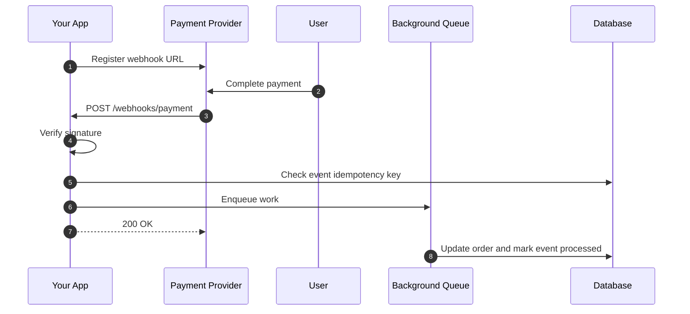

Let's think about this.

You ordered a pizza. Now you have two choices.

**Option 1: polling.**
You call the pizza shop every 30 seconds.

"Is my pizza ready?"
"No."
"Is it ready now?"
"No."
"Ready?"

You are wasting your time, their time, and network resources for almost nothing.

**Option 2: webhook.**
You give them your phone number. They call you when the pizza is ready. You go live your life.

That is the core idea behind a webhook.

No magic. No special protocol. Just an HTTP request sent in the opposite direction from what beginners usually expect.

## What Is a Webhook?

A webhook is an HTTP request that another system sends to your server when an event happens.

Usually it is an `HTTP POST` request with a JSON body:

```text
Payment Provider ---- POST /webhooks/payment ----> Your Server

"Hey, payment succeeded. Here is the event payload."
```

You register a URL with a third-party service. When something happens inside that service, it calls your URL.

The interesting part is the role reversal.

In a normal API flow, your application is the client and the third party is the server. With a webhook, the third party becomes the client and your application becomes the server.

Right?

If you want the REST background, read [Understanding State Transfer in REST](). Webhooks still use HTTP semantics; they just change who initiates the request.

## The Flow, Step by Step

Here is the high-level flow.



The raw registration might look like this:

```bash
curl -X POST https://api.payment-provider.example/webhooks \
  -H "Authorization: Bearer $API_TOKEN" \
  -H "Content-Type: application/json" \
  -d '{
    "url": "https://myapp.example.com/webhooks/payment",
    "events": ["payment.succeeded", "payment.failed"]
  }'
```

Then the user pays.

The provider fires a request into your system:

```http
POST /webhooks/payment HTTP/1.1
Host: myapp.example.com
Content-Type: application/json
X-Webhook-Event-Id: evt_123
X-Webhook-Signature: t=1780070400,v1=...

{
  "id": "evt_123",
  "type": "payment.succeeded",
  "amount": 100,
  "currency": "INR",
  "order_id": "order_456"
}
```

Your server handles it. Maybe you send an email, update the database, unlock a subscription, or ship an order.


## Why Webhooks Beat Polling

Polling means your system keeps asking:

"Anything new?"

Most of the time the answer is no. But you still paid for the TCP connection, TLS handshake if the connection was not reused, HTTP parsing, authentication, application code, logs, metrics, and database checks.

Nothing is free in software engineering.

| Concern | Polling | Webhooks |
| --- | --- | --- |
| Request volume | Constant, even when nothing happens | Only when an event fires |
| Latency | Depends on poll interval | Near real time |
| Resource usage | Wastes compute on empty checks | Uses compute when there is work |
| Ownership | Your app pulls repeatedly | Provider pushes once it knows |
| Complexity | Simple client loop | Needs public endpoint, retries, and security |

Polling is not always bad. It is predictable, easy to debug, and works when the other system cannot call you back.

But when you need event notifications, polling is usually the brute-force approach. Webhooks are cleaner because the system that owns the event tells you when the event exists.

## The Problem: What If Your Server Is Down?

Now the real engineering starts.

What happens if the provider sends the webhook, but your server is down?

Maybe your deployment restarted. Maybe DNS failed. Maybe your load balancer dropped the connection. Maybe your application accepted the TCP connection but timed out before returning a response.

Most webhook providers handle this with retries:

- Retry after a short delay.
- Increase the delay with exponential backoff.
- Stop after a maximum number of attempts.
- Some providers expose a dead letter queue or delivery log.

The important detail is this:

**A webhook can arrive more than once.**

That means your handler must be idempotent.

If the same `payment.succeeded` event arrives three times, you should not charge the customer three times. You should process the event once and return `200 OK` for duplicates.


The exact database code depends on your stack, but the principle does not change:

Store the event ID. Check it before doing irreversible work. Make the insert unique so two workers cannot process the same event at the same time.

## Securing the Endpoint

A public webhook endpoint is just an HTTP endpoint on the internet.

So ask the obvious question:

How do you know the request really came from the provider and not someone pretending to be the provider?

The answer is webhook signature verification.

Most providers sign the raw request body with a shared secret. Your server recomputes the signature and compares it with the signature header.


There are two details people get wrong.

First, verify the **raw body**, not the parsed JSON object. JSON parsing can change whitespace and ordering. HMAC works on bytes.

Second, use constant-time comparison. A normal string comparison can leak timing information.

In production, use the provider's official SDK or documented verification algorithm. Stripe, GitHub, Shopify, Twilio, and payment providers all have slightly different header names and signing formats.

The security checklist is simple:

- Use HTTPS only.
- Verify the webhook signature.
- Reject requests with missing or invalid signatures.
- Store and check event IDs for idempotency.
- Optionally restrict source IPs if the provider publishes stable IP ranges.

Never skip signature verification. Ever.

## Fast Acknowledgment, Slow Processing

Another trap: doing too much work inside the webhook request.

Suppose the provider expects a response within 5 seconds. Your handler validates the event, writes to the database, calls an email API, updates inventory, calls a CRM, and then waits on a slow third-party service.

Now your response takes 12 seconds.

From the provider's point of view, delivery failed. It retries. Your system now receives a duplicate event.

The better pattern is:

1. Verify the request.
2. Store the event.
3. Push work to a queue.
4. Return `200 OK` quickly.
5. Let a background worker do the slow work.


But there is a trade-off. You made the HTTP path fast, but now you own queue reliability. If the queue is down, if the worker crashes, or if the event store is not durable, you can still lose work.

That is why serious webhook systems persist the event before acknowledging it.

This starts to look similar to event-driven backend systems. For a deeper look at persistent event streams, check [Apache Kafka Part 1]().

## Webhooks vs WebSockets

Webhooks and WebSockets both get described as "real time", but they solve different problems.

| Concern | Webhooks | WebSockets |
| --- | --- | --- |
| Direction | Third-party server to your server | Full duplex between client and server |
| Protocol | HTTP request per event | Persistent WebSocket connection |
| State | Stateless delivery attempt | Stateful open connection |
| Use case | Payment event, GitHub push, order created | Chat, live dashboard, multiplayer updates |
| Scaling challenge | Retries and idempotency | Connection state and fan-out |

Use webhooks when another system needs to notify your backend about an event.

Use WebSockets when both sides need to talk over a long-lived connection.

If you want the TCP and HTTP upgrade mechanics behind WebSockets, read [Web Socket Overview]().

## Testing Webhooks Locally

Your laptop is usually behind NAT. The provider cannot call `localhost:3000` on your machine.

So you need a public URL that tunnels traffic back to your local server.

The common option is ngrok:

```bash
ngrok http 3000
```

That gives you a public HTTPS URL:

```text
https://abc123.ngrok.io -> localhost:3000
```

Register that URL with the provider while developing.

Cloudflare Tunnel can do the same thing with more control over identity and DNS. I covered that in [Securely SSH my Machine from Anywhere in the World]().

## Real-World Use Cases

You see webhooks everywhere:

- Payment providers notify you about success, failure, refunds, and disputes.
- GitHub notifies CI systems when a branch is pushed or a pull request is opened.
- Twilio notifies your app when an SMS is received.
- Shopify notifies your backend when an order is created.
- SendGrid notifies you when an email bounces or gets marked as spam.

The pattern is always the same:

Something happened in their system. They send an HTTP request to your system.

## Interview Prep

### What is a webhook and how does it differ from an API call?

A regular API call is pull. Your application calls another server and asks for data.

A webhook is push. A third-party server calls your endpoint when an event happens.

Webhooks reduce polling and make event-driven workflows easier.

### How do you secure a webhook endpoint?

Hit these points:

1. Verify the signature with the shared secret.
2. Require HTTPS.
3. Store event IDs and make processing idempotent.
4. Optionally use IP allowlisting if the provider supports stable IP ranges.

### What does idempotency mean in webhooks?

It means processing the same event multiple times produces the same final result.

This matters because webhook delivery is usually at-least-once, not exactly-once. Network failures, timeouts, and provider retries can send the same event again.

Store the provider's event ID and check it before doing side effects.

### Your webhook handler is slow. What do you do?

Decouple acknowledgment from processing.

Return `200 OK` after validating and storing the event. Push the expensive work to a background queue. Let workers process the event asynchronously.

### Design a webhook delivery system

If you are building the provider side, mention these components:

- Event store to persist events before delivery.
- Delivery workers to send HTTP requests to subscribers.
- Retry queue with exponential backoff.
- Dead letter queue after repeated failures.
- Delivery logs for debugging.
- Signature generation per endpoint secret.
- Alerting when delivery failure rate spikes.

At the end of the day, webhooks are simple HTTP requests wrapped in real distributed-systems problems: retries, timeouts, duplicates, authentication, and slow consumers.

That is why they look easy in tutorials and become fascinating in production.

{: .shadow w="700" h="400" }

## Reference

- [Webhook explanation video](https://youtu.be/x_jjhcDrISk)
