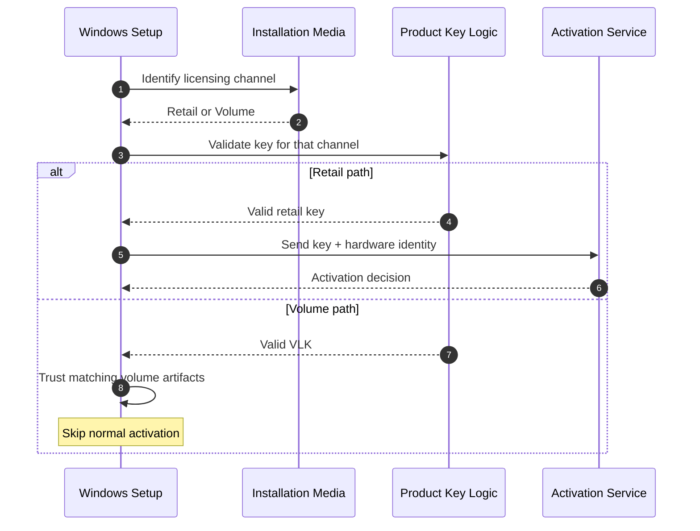

There is a famous Windows XP product key:

**FCKGW-RHQQ2-YXRKT-8TG6W-2B7Q8**

If you used computers in the early 2000s, you probably saw it written on CDs, posted on forums, or baked directly into pirated Windows XP images.

But the interesting part is not the key itself. The interesting part is the architecture behind it.

Because this story is really about one thing:

> What happens when you design a secure system with a trusted bypass path, and that bypass escapes into the public?

Let's break it down.

## How Windows XP Activation Normally Worked

When Microsoft introduced Windows XP, it also introduced Windows Product Activation. The goal was simple: prevent one retail copy of Windows from being installed on unlimited machines.

A normal installation roughly looked like this:

```text
Install Windows
      |
      v
Enter and validate the product key
      |
      v
Generate a hardware identity
      |
      v
Activate with Microsoft
      |
      v
Activation approved
```

The important part is the hardware identity. Windows collected information about the machine and created a fingerprint. Your license was no longer just:

```text
Product Key
```

It was closer to:

```text
Product Key + Machine
```

That is a much stronger licensing model. You cannot simply take the same retail key and install it everywhere without eventually triggering activation problems.

But then Microsoft had another problem.

## Enterprise Customers Break the Model

Imagine you are a company with 10 PCs. Activation is annoying, but manageable.

Now imagine 100,000 PCs. Some may not have Internet access. Some may exist in secure environments. Others may be installed automatically through deployment systems.

Microsoft could not realistically tell a giant enterprise:

> Please activate these 100,000 computers one by one.

So Microsoft created another path: Volume Licensing.

Windows XP effectively had two distribution channels:

```text
Retail Media + Retail Key
             =
     Activation Required
```

```text
Volume Media + Volume License Key
             =
      Activation Skipped
```

This is a very important design decision. Microsoft did not simply create a magic key that worked everywhere. The key was supposed to work only with special installation media.

Think of it as two conditions:

```text
IF
    key == valid_volume_key
AND
    media == volume_media
THEN
    skip_activation
```

That second condition mattered. A leaked volume key alone should not have been enough.

## How Did Windows Know It Was Volume Media?

Windows Setup needed a way to distinguish a retail CD from corporate Volume Licensing media.

According to former Microsoft engineer Dave Plummer's account, the installation media contained a special binary blob. Its contents were not important; its presence acted as a recognizable property of the media.

And now we arrive at one of the funniest details in Windows history: the source material for that blob was **Microsoft Bob**—the famously unsuccessful Microsoft graphical interface from the 1990s.

The data was processed, compressed, and encrypted multiple times before being placed on the installation media. Conceptually:

```text
Microsoft Bob data
       |
       v
Compression and encryption
       |
       v
~10 MB binary blob
       |
       v
Windows XP installation media
```

The actual content did not matter. Its presence did. Windows could verify something derived from this data and identify the expected media channel.

> The Microsoft Bob detail comes from Plummer's later account of the implementation, not from a public Windows XP protocol specification.
{: .prompt-info }

This is effectively a media-bound licensing signal.

## Why FCKGW Did Not Work on Every Windows XP CD

This is the part many people misunderstood. The famous FCKGW key was not simply a universal Windows XP key.

If you tried:

```text
Retail Windows XP CD
+
FCKGW key
```

it should fail, because the retail disc did not match the key's licensing channel.

You needed:

```text
Volume Windows XP ISO
+
Valid Volume License Key
```

When both conditions were satisfied, Windows followed the enterprise path. On that path, hardware activation was skipped.

That is why the leak became so powerful. The attackers did not just get the password. They got the entire trusted environment.

## A Two-Artifact Trust Model

You can almost think about Microsoft's design as requiring two things:

1. A valid Volume License Key.
2. Authentic Volume Licensing media.

Together:

```text
VLK + Volume Media = Offline enterprise installation
```

From Microsoft's perspective, this made sense. Volume keys were controlled. Volume media was controlled. Only trusted enterprise partners and large customers should have had access.

But there is a fundamental security principle here:

> If possession of two secret artifacts grants unlimited trust, leaking both artifacts destroys the trust model.

And that is exactly what happened.

## The Trust Boundary Expanded

Windows XP reached Release to Manufacturing on August 24, 2001. Retail launch was planned for October 25.

Between those dates Microsoft needed to give the final product to OEMs, hardware vendors, manufacturing partners, and enterprise partners. Dell, HP, and others could not receive Windows XP on October 25 and magically have millions of computers ready that same morning.

So Microsoft's trust boundary expanded:

```text
Microsoft
   |
   +-- OEMs
   +-- Hardware partners
   +-- Enterprise licensing partners
   +-- Manufacturing systems
```

Every additional organization became another potential leak point.

Several weeks before launch, the warez group commonly known as Devil's Own distributed something extremely valuable: not a beta, not a hacked build, but a final Windows XP Professional Corporate image.

And with it came the FCKGW key.

Notice what leaked:

```text
Key + Correct Volume Media
```

The complete trust package had escaped.

## The Security System Was Not Necessarily Broken

This is an important engineering distinction.

Hackers did not need to break the cryptography, reverse Microsoft's product-key mathematics, defeat hardware fingerprinting, or bypass Windows Product Activation.

The system itself said:

```text
Valid Volume Key?   YES
Valid Volume Media? YES
Enterprise customer? Assume yes

Skip activation.
```

The software behaved as designed. The assumptions behind the design were no longer true.

```text
Possession of Volume Media
+
Possession of VLK
=
Trusted enterprise
```

After the leak, anyone on the Internet could possess both. The identity assumption collapsed.

If you want another example of identity being inferred from machine data, see [LinkedIn's browser fingerprinting architecture](). Different system, same lesson: a signal is useful only while its assumptions hold.

## The Bypass-Path Problem

A lot of security incidents are not cryptographic failures. They are trust failures.

You can have AES, RSA, hashes, digital signatures, hardware fingerprints, and activation servers—and still lose. Somewhere in the architecture there may be:

```text
if trusted_customer:
    bypass_security()
```

The question becomes: **How do you prove `trusted_customer`?**

Windows XP Volume Licensing effectively answered:

```text
Does this machine have the expected media?
AND
Does it have a valid Volume License Key?
```

That works only while those artifacts remain controlled.

The entire point of Volume Licensing was to avoid the normal activation path. Once an attacker entered the volume path, the strongest part of the retail protection mechanism never executed.



You can spend enormous effort securing the main authentication path while creating an administrative path that completely bypasses it.

Modern examples include emergency admin accounts, recovery tokens, API master keys, service credentials, debug modes, factory provisioning keys, and internal certificates.

Every bypass becomes part of your security architecture. The same principle appears in infrastructure isolation: the primary boundary is only as strong as the privileged escape paths around it. I explored that idea in [The Architecture of Isolation]().

## Why FCKGW Became Legendary

The key spread quickly. Pirated XP CDs appeared with it preconfigured in the installer—or literally written on the disc.

From the user's perspective, the experience was incredible:

```text
Install Windows XP
Enter the key
No activation
Windows boots normally
```

Pirated Windows looked almost exactly like licensed corporate Windows because the operating system believed it was running under the legitimate corporate licensing mechanism.

Microsoft could not simply remove Volume Licensing. Huge companies legitimately depended on it. Imagine deploying an XP service pack and suddenly telling a Fortune 500 company:

> By the way, activate your 200,000 machines individually.

Not happening.

So Microsoft attacked the leaked credentials instead. Windows XP Service Pack 1 began rejecting known leaked product keys and associated Product IDs. The architecture evolved from:

```text
Do you possess a valid key?
```

toward:

```text
Is this license actually authorized?
```

That difference is huge.

## Authentication, Authorization, and Revocation

The old model relied heavily on authentication by possession:

```text
You possess Volume media + Volume key
therefore
you are authorized.
```

But possession is not identity.

Modern licensing systems increasingly check a server-side entitlement:

```text
License ID
    |
    v
Server verifies organization, device, and policy
    |
    v
Authorization decision
```

That gives the vendor something incredibly valuable: **revocation**.

Suppose your licensing model is entirely offline. You issue a master key, and your software verifies it locally. If that key leaks, potentially nothing can stop it because every existing copy already knows how to validate it.

But if authorization depends on a server, a leaked credential can be disabled centrally. That is why modern systems often trade some offline convenience for control.

This does not make the online design free. Now availability depends on a network path, DNS, TLS, and the authorization service itself. If you want to unpack that transport layer, start with [What Is TLS/SSL?]().

## The Real Engineering Trade-Off

Microsoft's engineers were not making an irrational decision. They were solving a real operational problem:

```text
Enterprise requirement:
- 100,000 machines
- Offline networks
- Automated deployment
- No activation friction

Security requirement:
- Prevent ordinary users from bypassing activation
```

Those requirements conflict.

Microsoft chose:

```text
Volume Media + Volume Key = Offline trust
```

For legitimate customers, this was extremely convenient. But convenience came from moving the trust decision from Microsoft's servers into static artifacts.

Static secrets are dangerous because they can be copied. And digital copying has essentially zero marginal cost:

```text
1 copy -> 10 copies -> 1,000 copies -> 1,000,000 copies
```

Nothing is free in software engineering. Microsoft traded revocability and centralized control for offline deployment, low operational friction, and massive enterprise scale.

## The Engineering Lesson Behind FCKGW

The legendary FCKGW key was not powerful because somebody discovered a magical Windows XP master password. It became powerful because it was attached to an official Microsoft trust path.

The system effectively said:

```text
I trust this key.
I trust this media.
Therefore I trust this installation.
```

For legitimate enterprise customers, that assumption was reasonable. Then the Internet obtained both pieces, and the system confidently authenticated the wrong people.

That is why this story is much more interesting than “someone leaked a Windows key.”

It is a story about systems security. A trusted offline capability was represented by copyable artifacts. Those artifacts escaped. Once they did, no cryptographic sophistication inside the normal activation workflow mattered, because the normal workflow never ran.

**The weakest part of a security system is often not the lock.**

**It is the legitimate door designed to avoid using the lock.**

How many legitimate bypass paths exist in your architecture—and what happens when one escapes?

## Sources

- [Windows XP released to manufacturing on August 24, 2001](https://news.microsoft.com/source/2001/08/24/windows-xp-to-take-the-pc-to-new-heights/)
- [Microsoft documentation on matching Windows XP licensing channels and leaked VLKs](https://learn.microsoft.com/en-us/troubleshoot/windows-server/licensing-and-activation/change-volume-licensing-product-key)
- [Dave Plummer's Secret History of Microsoft Bob](https://www.youtube.com/watch?v=rXHu9OmLd8Y)
