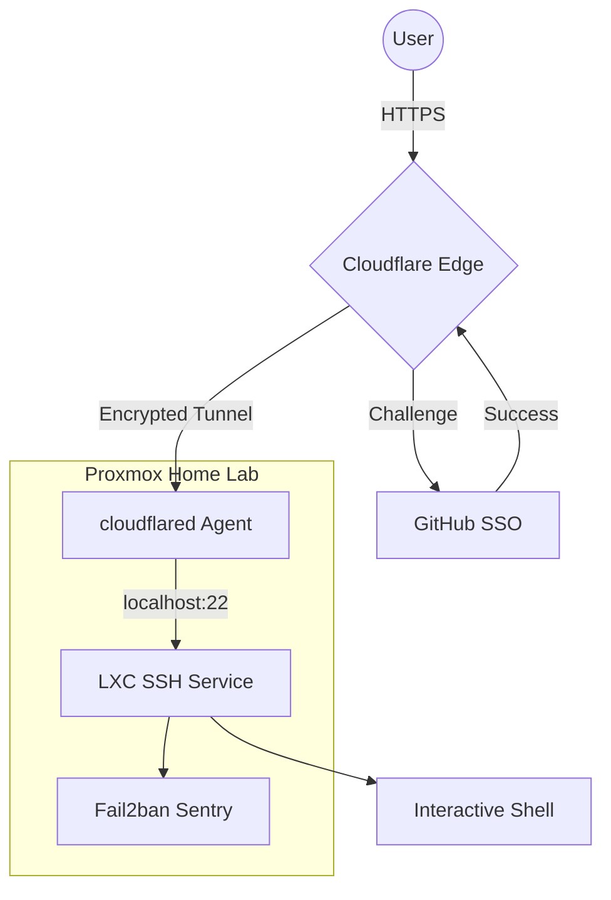

This is the definitive guide to building a "Zero-Exposure" remote terminal. We aren't just setting up a server; we are re-engineering how we think about network perimeters.

## The Death of Port Forwarding: A Deep Dive into Zero Trust SSH


I  finally got it working. But *why* does this setup matter? In a traditional setup, you open Port 22 on your router. The moment you do that, the entire world starts knocking. Every botnet from every corner of the globe begins brute-forcing your password.

In this architecture, we do something different

### The Architecture: How It Works Under the Hood

The magic here lies in the **Cloudflare Tunnel**. Instead of your router listening for a connection (Inbound), your LXC container reaches out to Cloudflare (Outbound) and says, "I am here." This creates a persistent, encrypted "wormhole" through your firewall.

### The Core Concepts:

1. **Identity-Based Perimeter (Layer 7):** We shifted security from the network layer (IPs/Ports) to the identity layer. Before a single packet reaches your LXC, Cloudflare demands a **GitHub OAuth** token. No token, no connection.
2. **NAT Traversal:** Because the connection is outbound, it doesn't matter if you are behind a CGNAT or a double-router setup. As long as the LXC has internet, the tunnel lives.
3. **Browser-Rendered Terminal:** Cloudflare acts as a proxy that converts SSH traffic into **WebSockets**. This allows your browser to act as a full-blown terminal emulator without needing a local SSH client.

### The Security Flow (Mermaid Diagram)



### The "All-In-One" Interactive Setup Script

This script handles the dependencies, the tunnel creation, the configuration, and the system persistence.

```bash
#!/bin/bash
# =================================================================
# ULTIMATE ZERO-TRUST LXC SETUP (Hussein Nasser Style)
# Target: ssh.harshityadav.in
# =================================================================

set -e # Exit on error

echo "Starting the Deep Dive Setup..."

# 1. Environment Preparation
apt update && apt install -y curl gnupg fail2ban
DOMAIN="ssh.harshityadav.in"

# 2. Interactive Input
read -p "Enter a unique name for this tunnel (e.g. proxmox-srv): " TUNNEL_NAME

# 3. Fail2ban Hardening
# We ignore 127.0.0.1 because the tunnel traffic looks like it comes from localhost
cat <<EOF > /etc/fail2ban/jail.local
[sshd]
enabled = true
port    = 22
ignoreip = 127.0.0.1/8
maxretry = 5
bantime = 3600
EOF
systemctl restart fail2ban

# 4. SSH Server Configuration
# We enable passwords but keep root login secure via the SSO layer
sed -i 's/^#*PasswordAuthentication.*/PasswordAuthentication yes/' /etc/ssh/sshd_config
sed -i 's/^#*PermitRootLogin.*/PermitRootLogin no/' /etc/ssh/sshd_config
systemctl restart ssh

# 5. Cloudflare Tunnel Deployment
# Cleanup old artifacts
rm -f /root/.cloudflared/cert.pem
cloudflared service uninstall 2>/dev/null || true

echo "Authenticate with Cloudflare now..."
cloudflared tunnel login

echo "Creating Tunnel..."
TUNNEL_ID=$(cloudflared tunnel create "$TUNNEL_NAME" | grep -oE "[a-f0-9]{8}-([a-f0-9]{4}-){3}[a-f0-9]{12}")

# 6. Writing the Configuration
mkdir -p /etc/cloudflared
cat <<EOF > /etc/cloudflared/config.yml
tunnel: $TUNNEL_ID
credentials-file: /root/.cloudflared/$TUNNEL_ID.json

ingress:
  - hostname: $DOMAIN
    service: ssh://localhost:22
  - service: http_status:404
EOF

# 7. DNS Routing and Persistence
cloudflared tunnel route dns "$TUNNEL_NAME" "$DOMAIN"
cloudflared service install
systemctl start cloudflared
systemctl enable cloudflared

echo "Architecture Deployed. Visit https://$DOMAIN to login."
```

### Security Best Practices for this Setup

- **The "Ignore IP" Rule:** In the script, we tell Fail2ban to ignore `127.0.0.1`. **Why?** Because `cloudflared` proxies the connection locally. If you fail your password and Fail2ban bans localhost, it kills the tunnel for everyone. But since we are using cloudflare zero trust this can be setup or not used by increasing firewall rules at cloudflare level
- **The GitHub Perimeter:** Since you are using a "simple password" for the LXC, your **GitHub 2FA** is now your primary defense. If your GitHub is compromised, your server is compromised. **Enable hardware keys (Yubikey) on GitHub.**
- **Update Cadence:** Cloudflare updates the `cloudflared` binary often to patch zero-day vulnerabilities in the tunneling protocol. Since we installed it as a service, it will handle reconnections, but you should periodically run `apt upgrade cloudflared`.

### Summary

You now have a system where the "Attack Surface" is virtually zero. No ports are open on your router. Your IP address is hidden. Authentication is handled by one of the world's most secure identity providers.

This is how we build  resilient infrastructure. Beautiful.

One small step to building the ENCOM infra , stark industry style i can control from anywhere


## Reference

- [Cloudflare Local Tunnel Guide](https://developers.cloudflare.com/cloudflare-one/connections/connect-networks/do-more-with-tunnels/local-management/create-local-tunnel/)
- [Cloudflare Zero Trust Dashboard](https://dash.teams.cloudflare.com/)
- [Cloudflare Tunnel Setup Guide](https://developers.cloudflare.com/cloudflare-one/connections/connect-apps/install-and-setup/tunnel-guide/)
- [Cloudflare Tunnel as a Linux Service](https://developers.cloudflare.com/cloudflare-one/connections/connect-apps/run-tunnel/as-a-service/linux/)
- [How to Enable SSH on Ubuntu](https://linuxize.com/post/how-to-enable-ssh-on-ubuntu-18-04/)
- [SSH Raspberry Pi with Cloudflare Tunnel](https://blog.cloudflare.com/ssh-raspberry-pi-400-cloudflare-tunnel-auditable-terminal/)
- [Browser SSH Terminal with Auditing](https://blog.cloudflare.com/browser-ssh-terminal-with-auditing/)
- [Hosting Webservers on Jio Fiber](https://broadbandforum.co/threads/guide-how-to-host-webservers-on-jio-fiber-accessible-to-ipv4-clients.204996/page-2)
- [SSH to IPv6 Address on Linux](https://linuxconfig.org/how-to-ssh-to-ipv6-address-on-linux)
- [Reverse SSH Tunnel Guide](https://www.xmodulo.com/access-linux-server-behind-nat-reverse-ssh-tunnel.html)
- [SSH into Private Machines via Cloudflare Tunnel](https://orth.uk/ssh-over-cloudflare/)
- [No IPv4 Blog Post](https://jamesmcm.github.io/blog/no-ipv4/)
- [Hacker News Discussion](https://news.ycombinator.com/item?id=44411273)
- [Cloudflare Zero Trust Tunnels](https://david.coffee/cloudflare-zero-trust-tunnels)
