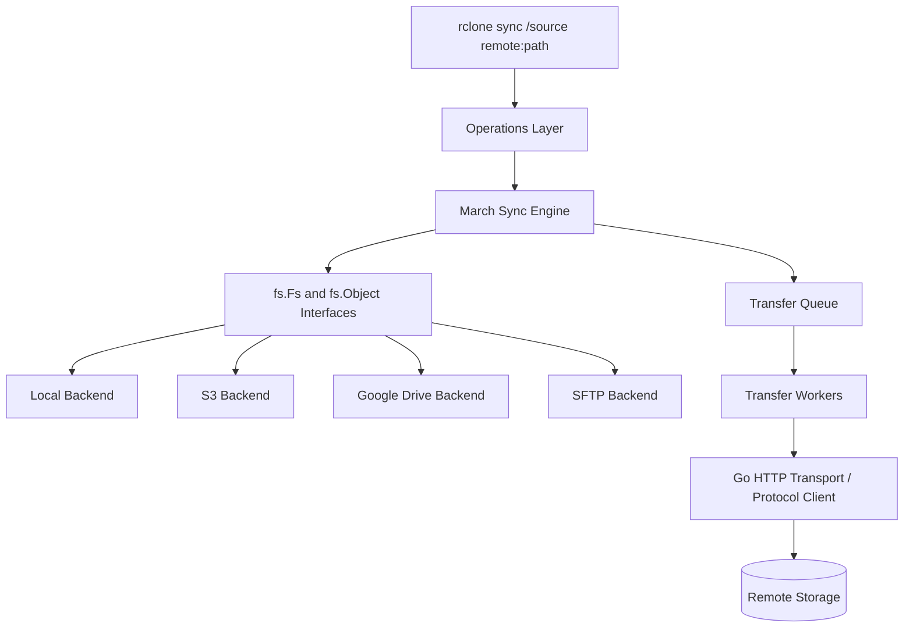
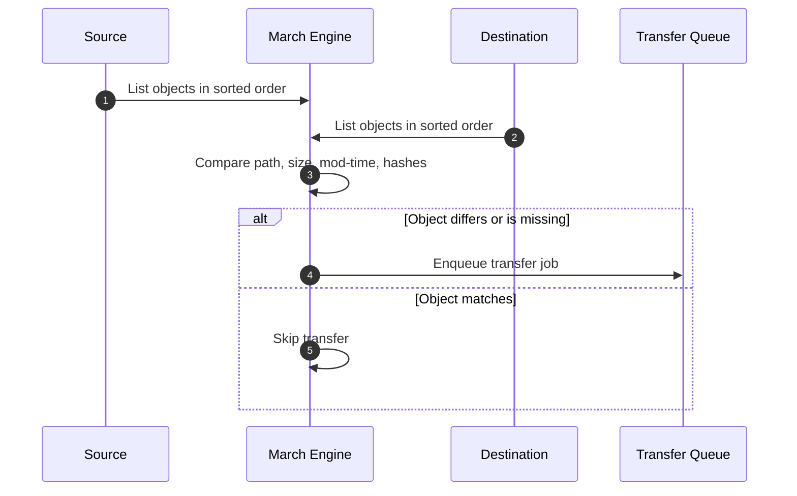
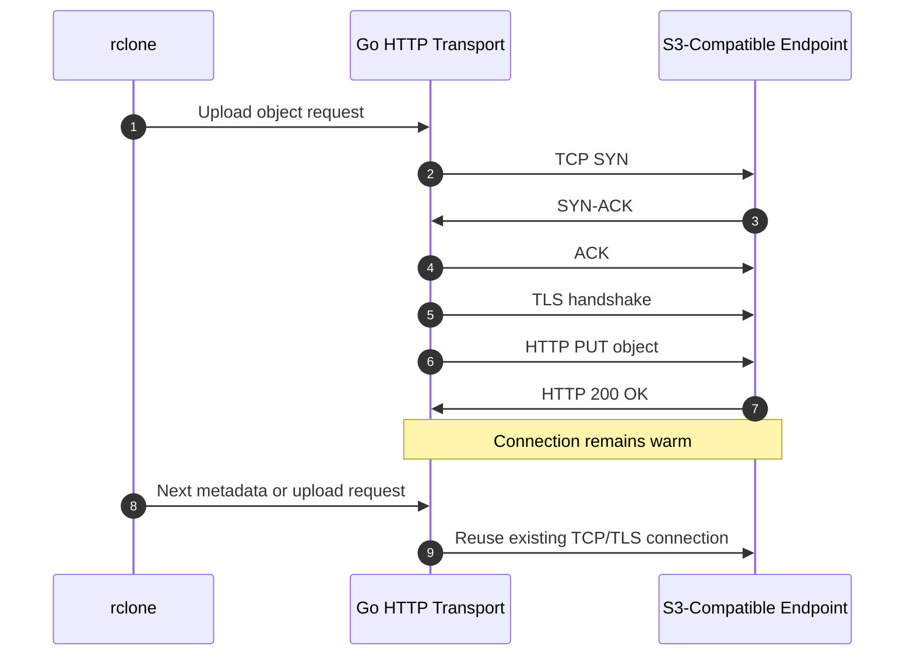
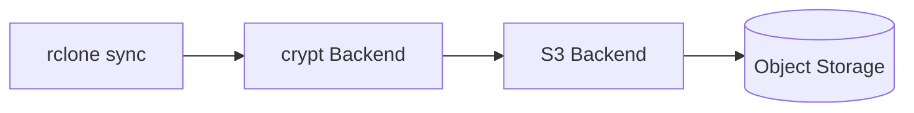

Let's think about this.

You have a Proxmox container, a local ZFS dataset, a Google Drive remote, and an S3 bucket. You want one boring command that can move data between all of them:

```bash
rclone sync /tank/backups s3:skynet-backups/proxmox --progress
```

Simple command. But under the hood, this is not simple at all.

Local disk speaks POSIX-ish filesystem calls. S3 speaks HTTP object APIs. Google Drive has its own file metadata model, rate limits, upload sessions, and checksum behavior. SFTP is a completely different protocol. And still, rclone gives you one mental model: source, destination, compare, transfer.

That is the architecture worth understanding. Rclone is not just a "copy tool". It is a storage abstraction layer, a sync engine, and a network transfer scheduler packaged into one Go binary.

If you care about homelab backups, this connects directly to the storage decisions I wrote about in [Picking Storage Format](). The filesystem matters, but the sync layer above it matters too.

## The Problem: Cloud Storage Is Not a Filesystem

On a local filesystem, listing a directory and opening a file is cheap.

On cloud storage, those actions become remote API calls. A directory listing might be an HTTP request. Reading object metadata might be another HTTP request. Uploading a large file might become a multipart session with several concurrent `PUT` requests.

So if rclone is careless, performance collapses.

It can fail in a few ways:

- It can list too much and burn memory.
- It can open too many connections and hit provider limits.
- It can upload huge files through one fragile stream.
- It can compare files incorrectly because not every backend exposes the same hashes or timestamp precision.
- It can retry blindly and accidentally amplify API traffic.

At the end of the day, rclone has to normalize very different storage systems without pretending they are identical. That is the hard part.

## The Architecture

At a high level, rclone has three important layers:



The important idea is separation.

The sync engine should not care whether the destination is S3, Google Drive, Backblaze B2, SFTP, or local disk. It should ask basic questions:

- What objects exist here?
- What is their size?
- What is their modification time?
- What hashes are available?
- Can I open this object for reading?
- Can I write this object to the destination?

The backend driver translates those generic operations into the actual protocol call.

## The VFS Abstraction Layer

How does rclone talk to dozens of completely different storage backends with the same `rclone sync` command?

It uses interface-driven architecture. In the rclone source, the `fs` package defines the generic filesystem abstraction used by backends. The two important concepts are:

- `Fs`: the remote filesystem or storage namespace. It handles operations like listing, creating directories, and putting objects.
- `Object`: one file-like object. It exposes operations like opening, updating, removing, and reading metadata.

This is the architectural trick. When you configure `s3:`, rclone loads the S3 backend. When you configure `drive:`, it loads the Google Drive backend. Both backends implement the same core interface shape, but the implementation underneath is completely different.

{: .shadow width="700" height="467" }

For S3, `Put` eventually becomes object-storage API calls over HTTP. For local disk, it becomes filesystem operations. For SFTP, it becomes SSH-backed file operations.

The sync engine does not need to know the details. It calls the abstraction. The backend pays the protocol cost.

Beautiful, right? But there is a catch.

The abstraction can only expose what the backend can actually provide. Some remotes support MD5. Some support SHA1. Some have weak or missing mod-time precision. Some can do server-side copy. Some cannot. So rclone does not get one perfect filesystem. It gets a lowest-common-denominator model with optional capabilities.

That is why flags like `--checksum`, `--size-only`, `--ignore-times`, and `--fast-list` exist. They are not random knobs. They are escape hatches for backend behavior.

## The March Algorithm: Comparing Without Downloading Everything

Now comes the sync problem.

When you run:

```bash
rclone sync /tank/photos s3:archive/photos
```

rclone has to decide what changed. The naive approach would be terrible:

1. Download every destination object.
2. Hash every source file.
3. Compare byte by byte.
4. Upload the differences.

That does not scale. You do not want to download terabytes just to discover that only three files changed.

Instead, rclone uses a tree-walk sync engine often referred to internally as "march". The idea is to walk the source and destination listings together and compare metadata first.



Rclone compares the cheap signals first:

1. **Path:** Does the object exist on both sides?
2. **Size:** If the size differs, the object probably changed.
3. **Modification time:** If the backend supports usable mod-times, compare them.
4. **Hash:** If both sides expose a compatible hash, compare it.

{: .shadow width="467" height="700" }

This is why backend capability matters. S3 ETags may look like MD5 hashes for simple uploads, but multipart uploads change that behavior. Google Drive may expose different checksum metadata. SFTP might not have a cloud-style object hash at all.

So rclone makes a pragmatic decision: use the best comparison available for that source and destination.

## Checkers and Transfers

This is where Go's concurrency model becomes useful.

rclone does not process every file sequentially. It splits the work into two broad groups:

- **Checkers:** workers that compare metadata and decide whether an object needs action.
- **Transfers:** workers that move bytes once an object has been selected.

The defaults matter. In the official rclone options, `--checkers` defaults to `8`, and `--transfers` defaults to `4`.

```bash
rclone sync /tank/backups s3:skynet-backups/proxmox \
  --checkers 16 \
  --transfers 8 \
  --progress
```

Why split them?

Because metadata checks and data transfers have different bottlenecks. A metadata check might be a fast HTTP `HEAD` or listing operation. A transfer might be a long-running stream that eats network bandwidth for minutes.

If you mix those two workloads carelessly, one large file can stall the discovery of smaller changes. By separating them, rclone can keep scanning while transfer workers move data in parallel.

{: .shadow width="467" height="700" }

This is the producer-consumer model:


But nothing is free in software engineering.

Increasing `--transfers` can improve throughput until you hit the next limit: disk read speed, upload bandwidth, CPU for encryption, provider API limits, or memory used by multipart buffers. More concurrency is not automatically better.

If you are using rclone inside a container, this looks similar to the networking constraint I discussed in [The Skynet Gateway](). The application can be well designed, but the host network path still decides the real ceiling.

## Networking and HTTP I/O

Here is where performance is won or lost.

Imagine uploading 100,000 tiny files to an object store. If every file opened a brand new TCP connection, the overhead would be brutal:

1. TCP three-way handshake.
2. TLS handshake.
3. HTTP request.
4. Response.
5. Connection close.

Repeat that thousands of times and your throughput dies before storage becomes the bottleneck.

For HTTP-based backends, rclone relies on Go's HTTP transport behavior: keep connections alive, reuse them where possible, and use HTTP/2 when supported unless disabled. This means multiple API calls can reuse warm TCP/TLS sessions instead of paying the handshake cost again and again.

{: .shadow width="467" height="700" }

The packet-level story looks like this:



This is why network tuning flags exist. For example:

```bash
rclone sync /tank/backups s3:skynet-backups/proxmox \
  --transfers 4 \
  --checkers 8 \
  --tpslimit 10 \
  --retries 5 \
  --low-level-retries 10
```

`--tpslimit` is especially useful when the remote provider starts rate limiting you. It is better to move steadily than to hammer the API, get throttled, retry, and create a self-inflicted traffic storm.

This is the same theme as tunnel-based remote access in [Securely SSH my Machine from Anywhere in the World](). The command looks simple, but the real behavior is shaped by TCP sessions, TLS, proxying, retries, and remote limits.

## Multipart Uploads and Chunking

Now take a large file: a 50 GB database dump.

If rclone uploads it through one long stream and the connection dies near the end, that is painful. Some backends support multipart or chunked upload flows so the transfer can be split into smaller parts.

For capable destinations, large transfers may use multiple streams. The official rclone docs describe `--multi-thread-streams` defaulting to `4` when multi-thread transfers apply, with `--multi-thread-cutoff` defaulting to `256M`.

```bash
rclone copy /tank/dumps/postgres-2026-06-10.dump s3:skynet-backups/dumps \
  --multi-thread-streams 4 \
  --multi-thread-cutoff 256M \
  --progress
```

The flow becomes:

1. Split the large object into chunks or ranges supported by the backend.
2. Upload parts concurrently.
3. Let the remote assemble or finalize the object.
4. Verify metadata where the backend supports it.

{: .shadow width="467" height="700" }

This is great for throughput, but again, there is a trade-off.

More streams can mean more memory, more open connections, more provider-side requests, and more pressure on the source disk. On a small homelab box, pushing every knob to the maximum can make the system slower, not faster.

The practical tuning path is boring and correct:

```bash
rclone sync /tank/backups s3:skynet-backups/proxmox \
  --checkers 8 \
  --transfers 4 \
  --multi-thread-streams 4 \
  --progress \
  --dry-run
```

Start with defaults. Run a dry run. Increase one knob at a time. Watch bandwidth, CPU, memory, disk I/O, and provider throttling.

## What Happens When Crypt Is Involved?

rclone also supports layered backends like `crypt`.

That means you can define an encrypted remote on top of another remote:

```text
local disk -> rclone crypt -> s3 backend -> object storage
```

Architecturally, this is powerful because encryption becomes another layer in the pipeline. The sync engine still talks to an `Fs`. The crypt backend wraps another `Fs`, transforms names and content, and passes encrypted bytes downward.

So a read path looks like:



And the write path is the reverse: source bytes enter the pipeline, crypt transforms them, and the base backend uploads encrypted objects.

The cost is CPU and debuggability. If you encrypt filenames and content, the remote becomes safer to store on untrusted infrastructure, but it is harder to inspect manually. Again, no magic. You are trading operational visibility for confidentiality.

## Trade-Offs and Limitations

Rclone's architecture is pragmatic, not perfect.

**Pros:**

- One command model works across many storage systems.
- Backend interfaces keep the sync engine clean.
- Checkers and transfers make concurrency explicit.
- HTTP connection reuse avoids handshake overhead.
- Multipart and multi-thread transfers help large objects.
- Layered backends like `crypt` compose nicely.

**Cons:**

- The abstraction leaks because backends expose different capabilities.
- Hash comparison is not equally strong across all remotes.
- More concurrency can trigger rate limits or memory pressure.
- Multipart behavior depends on destination support.
- Cloud API semantics are not the same as local filesystem semantics.
- Sync is dangerous if you do not understand deletes.

That last point matters. `rclone sync` makes the destination match the source. If the source is empty because a mount failed, the destination can be emptied too.

Use `--dry-run` and `--interactive` when testing:

```bash
rclone sync /tank/backups s3:skynet-backups/proxmox \
  --dry-run \
  --interactive
```

The most dangerous backup tool is the one that works perfectly in the wrong direction.

## Conclusion

Rclone works because it refuses to make cloud storage look more uniform than it really is.

It gives you a clean interface: remotes, objects, sync, copy, mount, crypt. But underneath that interface, it still respects the ugly details: HTTP requests, TCP reuse, provider throttling, checksum differences, multipart uploads, and backend-specific behavior.

That is good engineering.

The command is simple:

```bash
rclone sync source remote:path
```

But the architecture underneath is a careful balance between abstraction and reality. And once you understand that, you stop treating rclone as a magic backup command and start treating it like what it really is: a storage transfer engine with explicit trade-offs.


