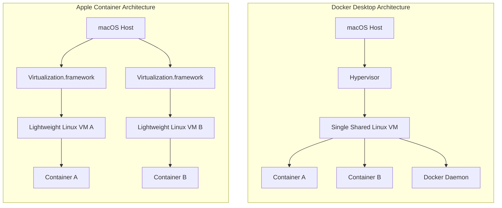

{: .shadow w="1024" h="559" }

Apple’s new `container` tool is not "Docker Desktop with an Apple logo." That is the wrong mental model.

The better model is this:

> **Apple Container runs Linux containers on macOS by putting each container inside its own lightweight Linux VM.**
{: .prompt-info}

Let's think about this. How do we actually run a container on macOS when the container image itself is built for Linux? Let's unpack the abstraction.

---

## Why Does This Exist?

Because macOS is not Linux. 

Linux containers depend on Linux kernel features: namespaces (PID, mount, network, user), cgroups (resource limits), mounts, networking primitives, Linux filesystems, and capabilities. On a Linux host, Docker and Podman run containers directly on the host kernel. There is no virtualization overhead because the containerized processes share the host kernel. 

But on macOS, there is no Linux kernel to share. The macOS kernel (Darwin/XNU) does not understand Linux system calls or namespaces.

Historically, Docker Desktop on Mac solves this by running a Linux VM (typically powered by `HyperKit` or `Virtualization.framework`), and then running all of your containers *inside* that single VM. Docker Desktop acts as a complete developer platform: Docker Engine, Docker CLI, Docker Compose, Kubernetes integration, and a rich desktop UI. 

Apple said: okay, but what if we do this differently?

Instead of one big shared Linux VM hosting all your containers, Apple's Containerization framework executes **each Linux container inside its own lightweight VM**. 

Let's look at the architectural difference visually:

By dedicating a lightweight VM to each container, Apple changes the security, networking, memory behavior, and process isolation model. If you want to understand how isolation boundaries work at a fundamental level, check out my deep dive on [The Architecture of Isolation]().

---

## Apple Container vs Docker

Docker is the ecosystem king. Apple Container is the native runtime experiment that became real.

Docker gives you a mature ecosystem: Compose, Docker API socket, Testcontainers compatibility, Dev Containers, Kubernetes in Docker Desktop, Docker Hub integration, and the muscle memory of `docker run`, `docker compose up`, and `docker build`.

Apple Container gives you something narrower but highly optimized: a native macOS container runtime built on Apple system frameworks like `Virtualization.framework`, `vmnet`, XPC, launchd, Keychain, and unified logging. 

The core benefit here is **security and hardware-level isolation**. In Docker Desktop on Mac, if a process escapes a container, it lands inside the shared Linux VM. It can potentially see or interfere with other containers running in that same VM. In Apple Container, each container gets VM-level hardware isolation. A container escape only lands you inside that specific container's dedicated lightweight VM. Apple's design gives each container the isolation properties of a full VM while keeping the resource footprint minimal.

---

## Can You Run a Local Image Built by Docker?

Not automatically from Docker Desktop's local image store.

Apple Container has its own image store and image management service. Apple’s architecture describes `container-core-images` as managing the local content store for Apple Container. Since it's OCI-compliant (Open Container Initiative), it can pull and run the exact same images from Docker Hub, but it manages them separately.

### **What About Kubernetes?**

We have to separate the layers here. Comparing Apple Container to Kubernetes is like comparing a car engine to a traffic control system.

*   **Apple Container** is a *runtime environment*. It just runs the container processes.
*   **Kubernetes** is an *orchestrator*. It schedules, scales, and manages thousands of containers across multiple servers. 

You could, theoretically, run a local Kubernetes cluster (like Kind or Minikube) that uses Apple Containers as the underlying nodes, but they do two completely different jobs.

---

## Where It Excels vs. Where It Lags

Nothing is free in software engineering. Let's look at the trade-offs.

### **Where it Excels (The Good Stuff):**

*   **Apple Silicon Synergy:** Because it's built directly on `Virtualization.framework`, it takes full advantage of M-series chips. The VM boot times are incredibly fast (often under a second), and resource allocation is dynamically managed by the macOS kernel.
*   **Hardware Isolation:** VM-level boundaries mean a vastly reduced attack surface. If you run untrusted code in a container, this is a massive win.
*   **Bridged Networking:** This is a killer feature. Because every container is actually a full-blown lightweight VM running via macOS `Virtualization.framework`, it natively supports **Bridged Networking**.

### **Where it Lags (The Reality Check):**

*   **Docker Compose:** This is the big blocker. As of right now, Apple Container lacks native, robust support for `docker-compose`. If your entire local stack relies on a massive `compose.yaml` file, you are going to struggle.
*   **Memory Overhead:** While these VMs are extremely lightweight, running 5 separate Linux VMs means running 5 separate Linux kernels and init processes. This consumes more memory than running 5 containers inside one shared VM.
*   **Ecosystem Maturity:** Docker has been around for over a decade. Apple Container is the new kid on the block. Edge-case bugs, logging quirks, and third-party tool integrations are still being ironed out.

---

## Answering Your Rapid-Fire Questions

### **1. Can I use it to replace Docker Desktop for running single images?**

Yes, absolutely. Because it is OCI-compliant, it can pull and run the exact same images from Docker Hub. If you just need to `run` an image (like spinning up a quick Postgres database for local testing), it works beautifully. But if you need complex multi-container orchestration, stick to Docker Desktop or Podman for now.

### **2. Can I use it to validate images built locally?**

100%. This is arguably its best use case right now. If you build an image and just want to validate that the entrypoint works, the environment variables map correctly, and the server starts—Apple Container is a fast, lightweight way to test it.

### **3. Can I assign it an IP in my LAN network and SSH into it?**

This is where the architecture gets really cool. If you configure the container to use a bridged interface instead of the default NAT, the VM will reach out to your physical router's DHCP server and obtain its own IP address on your local network (e.g., `192.168.1.50`).

If your Docker image has an SSH daemon (`sshd`) installed, configured, and running on port 22:

**Yes—you can absolutely SSH directly into that container from any machine on your Wi-Fi network.** 

Compare this to the tunnel-based approach I used to [Securely SSH my Machine from Anywhere](), where we run an agent inside the container to connect outwards to a third-party proxy. Here, the container acts as a first-class citizen on your physical LAN. Beautiful, right?

---

## PS: What is Bridged Networking?

In virtualization platforms like VirtualBox, VMware, or Apple's `Virtualization.framework`, **bridged networking** is a configuration that connects a VM directly to a physical network interface. 

The hypervisor utilizes a virtual switch to pass network frames directly through the host's physical Network Interface Card (NIC). Instead of sharing the host's IP via Network Address Translation (NAT), the VM gets its own MAC address and requests its own IP from the router's DHCP server. To the rest of the network, the VM looks like a separate physical computer plugged into the router.
